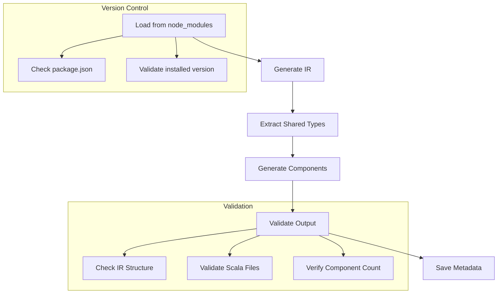

# WebAwesome Laminar

A type-safe Scala.js wrapper for [WebAwesome](https://webawesome.com/) components using [Laminar](https://laminar.dev/).

## Overview

This project generates Laminar bindings for all WebAwesome components, providing:

- **Type-safe attributes** with union type validation
- **Event handling** for all custom events
- **Slot management** for content projection
- **CSS custom properties** documentation
- **Method bindings** for imperative API access
- **Comprehensive documentation** generated from WebAwesome sources

## Quick Start

### Prerequisites

- **Scala.js** project with Laminar
- **Node.js** 18+ (for generation scripts)
- **Yarn** package manager

### Installation

1. **Clone this repository:**
   ```bash
   git clone <repository-url>
   cd webawesome-laminar
   ```

2. **Install dependencies:**
   ```bash
   yarn install
   ```

3. **Generate the component bindings:**
   ```bash
   npm run generate
   ```

### Usage

Import and use WebAwesome components in your Laminar application:

```scala
import io.github.nguyenyou.webawesome.laminar.*
import com.raquo.laminar.api.L.*

// Basic button
div(
  Button(
    _.variant := "brand",
    _.size := "medium",
    _.onClick --> observer,
    "Click me!"
  )
)

// Using the component-scoped syntax
div(
  Button.of(
    _.variant := ThemeVariant.brand,
    _.size := ComponentSize.medium,
    _.onClick --> observer,
    _ => "Click me!"
  )
)

// Input with validation
div(
  Input.of(
    _.`type` := InputType.email,
    _.placeholder := "Enter email",
    _.required := true,
    _.onWaInvalid --> validationObserver
  )
)

// Complex component with slots
div(
  Card.of(
    _.variant := ThemeVariant.neutral,
    _.slots.header("Card Title"),
    _ => p("Card content goes here"),
    _.slots.footer(
      Button.of(
        _.variant := ThemeVariant.brand,
        _ => "Action"
      )
    )
  )
)
```

## Component Generation

The project includes a robust generation system that creates Laminar bindings from WebAwesome's component metadata.

### Generation Commands

```bash
# Generate all components (recommended)
npm run generate

# Force regeneration (ignore cache)
npm run generate:force

# Verbose output for debugging
npm run generate:verbose

# Generate with validation
npm run generate:validate

# Individual generation steps
npm run generate:ir          # Generate intermediate representation
npm run generate:types       # Extract shared union types
npm run generate:components  # Generate component files
```

### Generation Options

| Option | Description |
|--------|-------------|
| `--force` | Force regeneration even if files are up to date |
| `--verbose` | Enable debug logging |
| `--validate` | Validate generated files |

### What Gets Generated

The generation process creates:

1. **`SharedTypes.scala`** - All union types used across components
2. **Component files** - One `.scala` file per WebAwesome component
3. **IR files** - Intermediate representation for debugging
4. **Metadata** - Generation summaries and version tracking

## Project Structure

```
webawesome-laminar/
├── scripts/                          # Generation scripts
│   ├── generate.ts                   # Main orchestrator
│   ├── gen-ir.ts                     # IR generation
│   ├── extract-shared-types.ts       # Union type extraction
│   ├── generate-components.ts        # Component generation
│   ├── utils.ts                      # Utilities and helpers
│   ├── custom-elements.json          # WebAwesome metadata
│   ├── webawesome-laminar-ir.json    # Generated IR
│   └── shared-types-mapping.json     # Type mappings
├── webawesome-laminar/src/           # Generated Scala sources
│   └── io/github/nguyenyou/webawesome/laminar/
│       ├── SharedTypes.scala         # Union types
│       ├── WebComponent.scala        # Base component trait
│       ├── Button.scala              # Generated components
│       ├── Input.scala               # ...
│       └── ...                       # (57 total components)
└── www/                              # Example application
    └── src/www/
        ├── App.scala
        └── Main.scala
```

## Architecture

### Component Structure

Each generated component follows this pattern:

```scala
object ComponentName extends WebComponent("wa-component-name") {
  // Type definitions
  type Self = ComponentName.type
  type Ref = ComponentElement & dom.HTMLElement
  
  // Attributes with proper types
  lazy val variant: HtmlAttr[ThemeVariant] = unionAttr("variant")
  lazy val disabled: HtmlAttr[Boolean] = boolAttr("disabled")
  
  // Events
  lazy val onWaChange: EventProp[dom.Event] = eventProp("wa-change")
  
  // Slots (if any)
  object slots {
    lazy val header: Slot = Slot("header")
    lazy val default: Slot = Slot("")
  }
  
  // CSS variables and parts (documentation only)
  object cssVars { ... }
  object cssParts { ... }
  
  // JavaScript facade for imperative API
  @js.native trait ComponentElement extends js.Object { ... }
}
```

### Type System

- **Union Types**: Centralized in `SharedTypes.scala` for reusability
- **Proper Mapping**: TypeScript types mapped to appropriate Scala types
- **Type Safety**: Compile-time validation of attribute values
- **Memory**: User preferences for type organization and primitive mapping [[memory:3710481]] [[memory:3709205]]

### Error Handling

The generation system includes comprehensive error handling:

- **Graceful degradation** when components fail to generate
- **Detailed error reporting** with component and phase context
- **Validation** of generated files and IR integrity
- **Incremental generation** to avoid unnecessary work

## Development

### Building the Example

```bash
# Compile Scala.js
./mill www.fullLinkJS

# Start development server
yarn dev
```

### Running Tests

```bash
./mill www.test
```

### Extending the Generator

The generation system is modular and extensible:

1. **Add new type mappings** in `scripts/gen-ir.ts`
2. **Extend union type detection** in `scripts/extract-shared-types.ts`
3. **Customize component generation** in `scripts/generate-components.ts`
4. **Add validation rules** in `scripts/generate.ts`

### Generation Pipeline



## Component Coverage

Currently supports **57 WebAwesome components**:

| Component | Description | Attributes | Events | Slots |
|-----------|-------------|------------|--------|-------|
| `Button` | Interactive buttons | 21 | 4 | 3 |
| `Input` | Form inputs | 31 | 7 | 7 |
| `Select` | Dropdown selection | 18 | 11 | 7 |
| `Dialog` | Modal dialogs | 4 | 5 | 4 |
| `Tooltip` | Contextual tooltips | 9 | 5 | 1 |
| ... | ... | ... | ... | ... |

*Total: 402 attributes, 137 events, 121 slots across all components*

## Contributing

1. **Fork the repository**
2. **Create a feature branch**
3. **Make your changes**
4. **Test the generation**: `npm run generate:validate`
5. **Submit a pull request**

### Guidelines

- Follow the existing code style
- Add tests for new functionality
- Update documentation
- Ensure generation still works with your changes

## Troubleshooting

### Common Issues

**WebAwesome not installed:**
```bash
yarn add @awesome.me/webawesome  # Install the package
```

**Types not found:**
```scala
// Ensure you import SharedTypes
import io.github.nguyenyou.webawesome.laminar.SharedTypes.*
```

**Component not found:**
```bash
npm run generate:force  # Force regeneration
```

**Update WebAwesome version:**
```bash
yarn add @awesome.me/webawesome@^3.1.0  # Update to specific version
npm run generate:force                   # Regenerate with new version
```

### Debug Mode

Enable verbose logging for detailed information:

```bash
npm run generate:verbose
```

### Validation

Run with validation to catch issues early:

```bash
npm run generate:validate
```

## License

This project is licensed under the same terms as WebAwesome. See [LICENSE](LICENSE) for details.

## Acknowledgments

- [WebAwesome](https://webawesome.com/) - The amazing web component library
- [Laminar](https://laminar.dev/) - The reactive UI library for Scala.js
- [Scala.js](https://www.scala-js.org/) - Scala to JavaScript compiler
